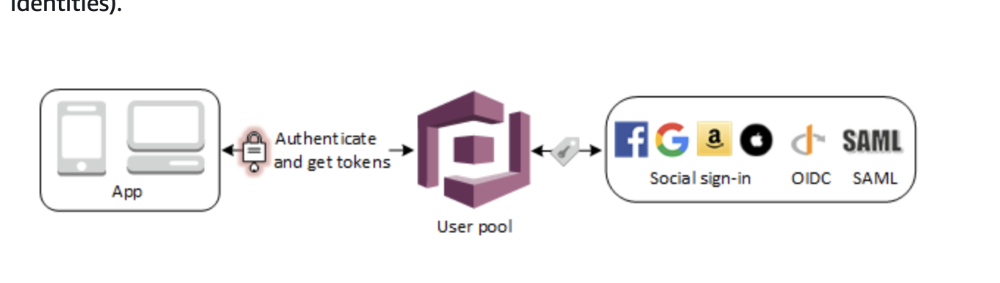
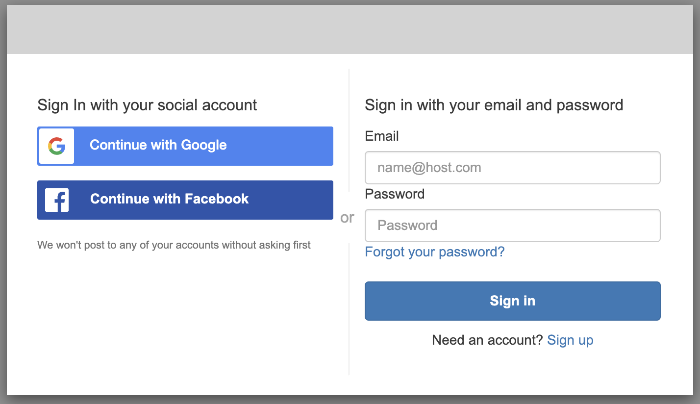
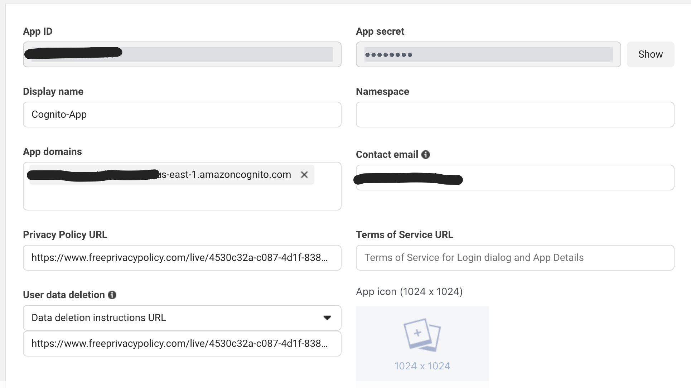
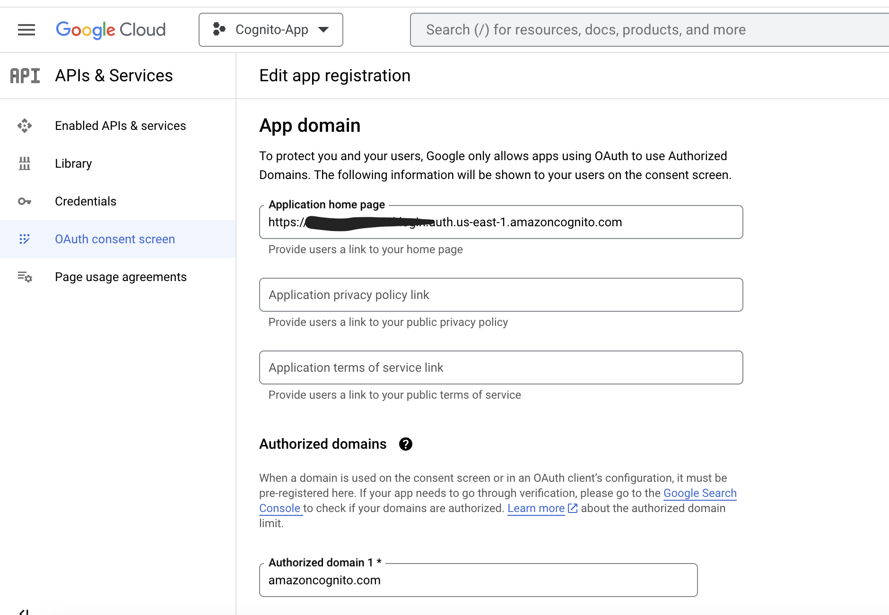

# React Cognito App with Social Sign-in

This is a React application defined on the [AWS CDK](https://docs.aws.amazon.com/cdk/v2/guide/home.html) that shows how to implement federated social sign-in using [AWS Cognito user pools](https://docs.aws.amazon.com/cognito/latest/developerguide/cognito-user-pools-identity-federation.html). 

Your app users can sign in either directly through a user pool, or federate through a third-party identity provider (IdP). The user pool manages the overhead of handling the tokens that are returned from social sign-in through Facebook and Google. With the built-in hosted web UI, Amazon Cognito provides token handling and management for authenticated users from all IdPs. This way, your backend systems can standardize on one set of user pool tokens.

The application is hosted in a S3 bucket with a CloudFront distribution in front of it.

**Current Functionalities**

 - Cognito sign in/sign out
 - Allow users to sign up
 - Cognito change/reset password

### Project Structure

    .
    ├── cognito
    |   |── cdk.ts                      # CDK construct with Cognito User Pool configuration
    |
    ├── react-site                      # React application
    |   |── cdk.ts                      # CDK construct for static website configuration
    |   |── src                         # React application code
    |   |── packages.json               # packages for React app
    |   |── tsconfig.json               # React TypeScript configuration
    |   |── linters and formatters for React code (.eslintrc.json, prettierrc)  
    |     
    |
    |── app.ts                          # Main CDK application (Constructs are imported here and deployed within Stacks)
    |
    |── CDK linters, packages and TypeScript configuration (.eslintrc.json, tsconfig.json)
    |
    └── ...

## Cognito with Social

 Sign-in through a third party (federation) is available in Amazon Cognito user pools. **This feature is independent of federation through Amazon Cognito identity pools (federated identities)**.

 When you connect Amazon Cognito to social, SAML, or OpenID Connect (OIDC) IdPs, your IdPs pass an [OIDC ID token](https://auth0.com/docs/authenticate/protocols/openid-connect-protocol) or a SAML assertion to Amazon Cognito. Amazon Cognito reads the claims about your user in the token or assertion and maps those claims to a new user profile in your user pool directory.

 Amazon Cognito then creates a user profile for your federated user in its own directory. Amazon Cognito adds attributes to your user based on the claims from your IdP and, in the case of OIDC and social identity providers, an IdP-operated public userinfo endpoint.


### Cognito Requirements

If you want your users to sign in with federated providers, you must create a [Cognito domain](https://docs.aws.amazon.com/cognito/latest/developerguide/cognito-user-pools-assign-domain-prefix.html). This sets up the Amazon Cognito hosted UI and OAuth 2.0 endpoints. Please notice that the hosted UI is required to integrate with supported social identity providers. When Amazon Cognito builds your hosted UI, it creates OAuth 2.0 endpoints that Amazon Cognito and your social IdPs use to exchange information. 

After adding a domain you also need to configure the allowed callback and sign-outs URLs on the Cognito app client. The social Identity Providers that will be configured later, will also need to be allowed on this app. See [here](https://docs.aws.amazon.com/cognito/latest/developerguide/cognito-user-pools-app-idp-settings.html) for more information related to app configuration. 


### Authentication flow with external identity providers

The [/oauth2/authorize endpoint](https://docs.aws.amazon.com/cognito/latest/developerguide/authorization-endpoint.html) is a redirection endpoint that supports two redirect destinations. If you include an `identity_provider` or `idp_identifier` parameter in the URL, it silently redirects your user to the sign-in page for that identity provider (IdP). Otherwise, it redirects to the Login endpoint with the same URL parameters that you included in your request.



To use the authorize endpoint, invoke your user's browser at /oauth2/authorize with parameters that provide your user pool with information about the following user pool details.
* The app client that you want to sign in to.
* The callback URL that you want to end up at.
* The OAuth 2.0 scopes that you want to request in your user's access token.
* Optionally, the third-party IdP that you want to use to sign in.

If you provide an `idp_identifier` or `identity_provider` parameter in your request, the Authorize endpoint redirects silently to your IdP, bypassing the hosted UI. 

We can understand this process better if we open the hosted UI after finishing the configuration of the user pool with the Facebook and Google identity provider. 



Facebook login button points to the oauth2 endpoint and the `redirect_url` points to the application url. The Cognito app_id and scopes are also specified. 

```
window.location.href='/oauth2/authorize?identity_provider=Facebook&redirect_uri=https://<website_domain>&response_type=CODE&client_id=<cognito_app_client_id>&scope=aws.cognito.signin.user.admin email openid phone profile
```

When you click on Facebook sign-in button, it redirects to the Facebook login page. 
You can see how the redirect url is pointing to the `user_pool_domain/outh2/idpresponse` endpoint.

```
https://www.facebook.com/login.php?skip_api_login=1&api_key=<facebook_app_id>&kid_directed_site=0&app_id=<facebook_app_id>&signed_next=1&next=https%3A%2F%2Fwww.facebook.com%2Fv15.0%2Fdialog%2Foauth%3Fclient_id%3D97%26redirect_uri=<user_pool_domain>/oauth2/idpresponse%26scope%3Dpublic_profile%252Cemail%26response_type%3Dcode%26state%3DH4sIAAAAAAAAAFWR23KbMBCG30XXhnCyDNzlgOOxaye1ndSh0-……………
```

After logging in to the identity provider (Facebook in this case), your IdPs pass an [OIDC](https://auth0.com/docs/authenticate/protocols/openid-connect-protocol) token to Amazon Cognito. Amazon Cognito reads the claims about your user in the token and maps those claims to a new user profile in your user pool directory. Amazon Cognito then creates a user profile for your federated user in its own directory. Amazon Cognito adds attributes to your user based on the claims from your IdP and, in the case of OIDC and social identity providers, an IdP-operated public userinfo endpoint.

After Amazon Cognito creates a profile for your federated user, it changes its function and presents itself as the IdP to your app, which is now the SP. Amazon Cognito is a combination OIDC and OAuth 2.0 IdP. It generates access tokens, ID tokens, and refresh tokens.


### Create Facebook App

You need to register a new application on the Facebook development portal.

Follow the steps described on the AWS documentation.
https://docs.aws.amazon.com/cognito/latest/developerguide/cognito-user-pools-social-idp.html#cognito-user-pools-social-idp-step-1

On step 9 (site URL), this is the same hosted UI URL. You can go to the Cognito app client and then click on hosted UI. 

You also need to create and publish a privacy and data deletion policy. 



In development mode, your app will have access to all permissions and features but access data for users with an app role (App Role -> Roles). To request end user data, your app must have advanced access permission and be set to live mode.

Notice that all applications must be set to live mode for production access. 

If your app will only be used by people who have a role on it, the permissions and features your app requires will only need Standard Access. If your app will be used by people who do not have a role on it, the permissions and features that your app requires will need [Advanced Access](https://developers.facebook.com/docs/graph-api/overview/access-levels/).


### Create Google App

Follow the steps described on the AWS documentation.
https://docs.aws.amazon.com/cognito/latest/developerguide/cognito-user-pools-social-idp.html#cognito-user-pools-social-idp-step-1



While publishing status is set to "Testing", only test users are able to access the app. 

You need to go through the verification process before launching a user-facing app. https://support.google.com/cloud/answer/7454865

### Add social IdPs to user pool 

You can take a look at the steps on the AWS documentation https://docs.aws.amazon.com/cognito/latest/developerguide/cognito-user-pools-social-idp.html#cognito-user-pools-social-idp-step-2

This was implemented on the [CDK definition](cognito/cdk.ts) of the Cognito user pool. 

```
new cognito.UserPoolIdentityProviderFacebook(this, 'FacebookIdP', {
    clientId: '901807381131417',
    clientSecret: process.env.FACEBOOK_APP_SECRET || '',
    userPool,
    attributeMapping: {
        email: cognito.ProviderAttribute.FACEBOOK_EMAIL,
        givenName: cognito.ProviderAttribute.FACEBOOK_NAME,
        familyName: cognito.ProviderAttribute.FACEBOOK_LAST_NAME
    },
    scopes: ['public_profile', 'email'],
    apiVersion: 'v15.0'
})

// Add Google Identity Provider to User Pool
new cognito.UserPoolIdentityProviderGoogle(this, 'GoogleIdP', {
    clientId: '142517483005-a430cqu9au7g9n5kodafojo3mdae7l5t.apps.googleusercontent.com',
    clientSecret: process.env.GOOGLE_APP_SECRET,
    userPool,
        attributeMapping: {
        email: cognito.ProviderAttribute.GOOGLE_EMAIL,
        givenName: cognito.ProviderAttribute.GOOGLE_GIVEN_NAME,
        familyName: cognito.ProviderAttribute.GOOGLE_FAMILY_NAME
    },
    scopes: ['profile email openid']
})
```

### Configure Authentication on React app

On the following two links below you can see how to configure [amplify](https://docs.amplify.aws) to add sign-in through social federated on the React app.

https://docs.amplify.aws/lib/auth/start/q/platform/js/#note-about-oauth-configuration-parameters

https://docs.amplify.aws/lib/auth/social/q/platform/js/

Amplify configuration on [authentication context API](react-site/src/store/auth-contect.tsx).
```
Auth.configure({
  region: 'us-east-1',
  userPoolId: process.env.REACT_APP_USER_POOL_ID,
  userPoolWebClientId: process.env.REACT_APP_WEBCLIENT_ID,
  identityPoolId: process.env.REACT_APP_IDENTITY_POOL_ID,
  mandatorySignIn: true,
  authenticationFlowType: 'USER_SRP_AUTH',
  // Configuration to sign-in through external social identity providers
  oauth: {
    domain: process.env.REACT_APP_USER_POOL_DOMAIN,
    scope: ['email', 'profile', 'openid', 'aws.cognito.signin.user.admin'],
    redirectSignIn: isLocalhost ? 'http://localhost:3000/' : process.env.REACT_APP_URL,
    redirectSignOut: isLocalhost ? 'http://localhost:3000/' : process.env.REACT_APP_URL,
    responseType: 'code' // or 'token', note that REFRESH token will only be generated when the responseType is code
  }
})
```

You can integrate your App by invoking `Auth.federatedSignIn()` function passing the identity provider in the argument. 

`Auth.federatedSignIn({provider: CognitoHostedUIIdentityProvider.Facebook })`


